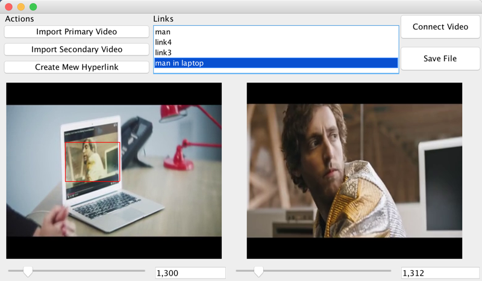

1 About
---
Hyper-video is a displayed video stream that contains embedded, user-clickable anchors allowing navigation between video and other hypermedia elements. 
Hyper-video is thus analogous to hypertext, where reader clicks on a word in one document to retrieve information from another document, or from another place in the same document. 
Hyper-video combines video with a non-linear information structure, allowing a user to make choices based on the content of the video and the user's interests.

2 Usage
---
The application consists of two parts, an authoring tool to setup hyper linked videos & an interactive video player to interact with hyper-videos.

With the authoring tool, you can 

* Import videos which used to set up your hyperlink source and target
* Navigate through all frames of the video a timeline with a slider
* Define and edit areas to track in the main video and setup up hyperlinks for this tracked area
* Save file – This will create a meta data file that contains all the hyperlink defined on the primary video

hyper-video player, you can 

* Play, pause, or stop a video
* By clicking a hyperlink, you would stop the current video and jump to corresponding video 
to play it from the frame defined during the setup phase

-- click -->

